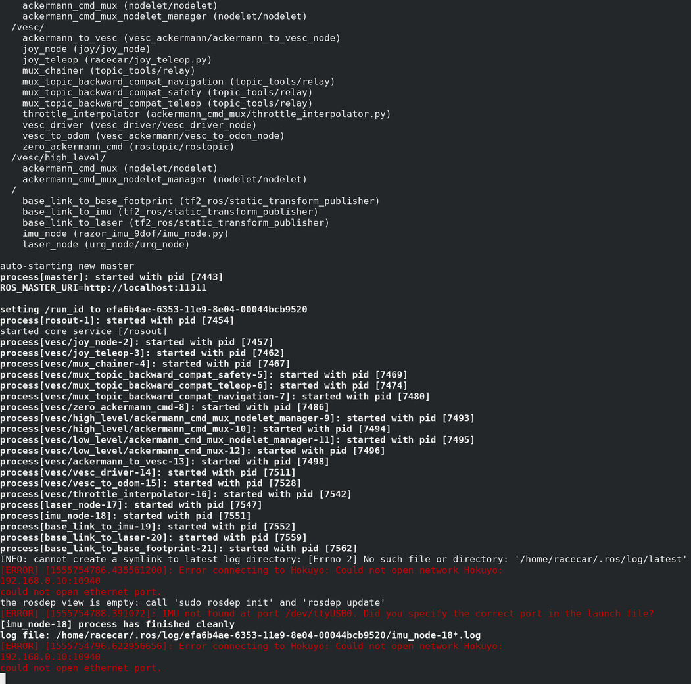
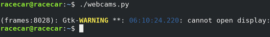
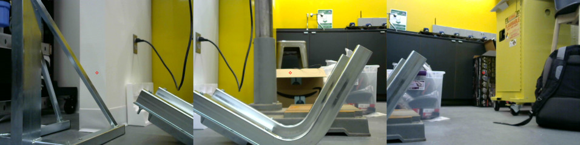
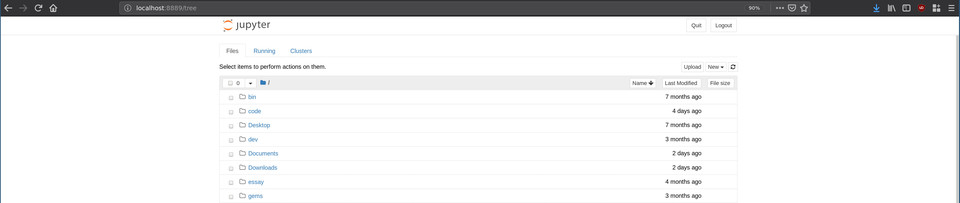
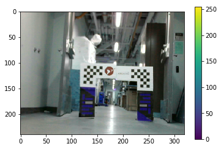
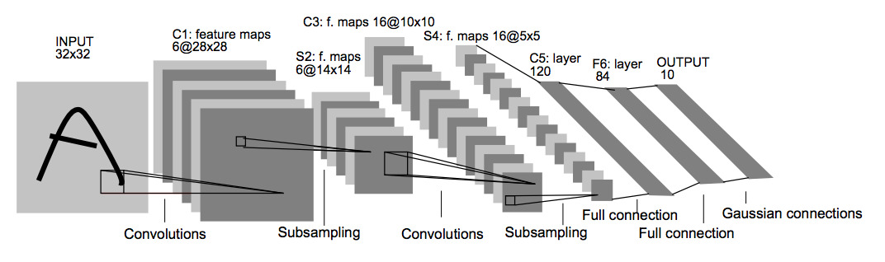
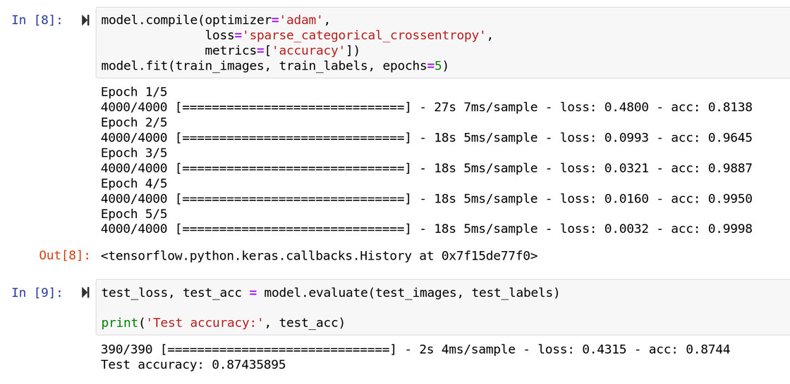
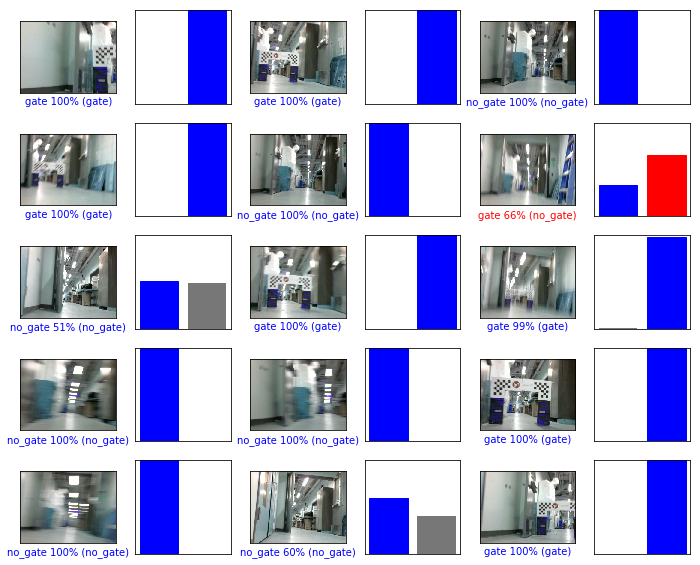
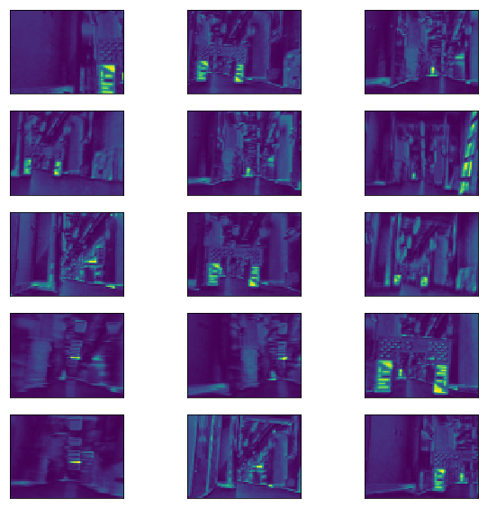

# Gate Detection Lab

### Overview

This lab is split into two parts. Part 1 will introduce you to the RACECAR
Model-X, its software stack, and how it differs from the RACECARs you've been
using throughout the semester. Part 2 will then have you implement simple deep
learning approach to object detection on the car.

<!-- This is a new lab that we hope to refine and integrate into future offerings of
RSS. Please ask any questions or share feedback on the
[NEET RSS Slack Channel](https://neet-rss-2019.slack.com). -->

# Part 1: RACECAR Model-X
The RACECAR Model-X (MX) is quite different from the Model-T (MT) cars used
throughout the semester. For instance:
- [NVIDIA Jetson TX2](https://developer.nvidia.com/embedded/buy/jetson-tx2-devkit)
has been upgraded for the
[NVIDIA Xavier](https://developer.nvidia.com/embedded/buy/jetson-agx-xavier-devkit)
(Model-T for TX2, Model-X for Xavier)
- LiDAR ([Hokuyo](https://www.robotshop.com/en/hokuyo-ust-10lx-scanning-laser-rangefinder.html)
or
[Velodyne](https://velodynelidar.com/vlp-16.html)) has been removed
- [Logitech F710 Joystick](https://www.logitechg.com/en-us/products/gamepads/f710-wireless-gamepad.html)
has been switched for a wired
[Xbox One Controller](https://www.xbox.com/en-US/xbox-one/accessories/controllers/xbox-black-wireless-controller) (due to driver compatibility)
- [ZED Stereoscopic Camera](https://www.stereolabs.com/zed/)
has been replaced with three
[Logitech C310 webcams](https://www.logitech.com/en-us/product/hd-webcam-c310)
- [SparkFun IMU](https://www.sparkfun.com/products/14001)
has been removed
- Chassis has been redesign to allow space for the taller Xavier dev board and
the mounting of multiple webcams

While the simplification of the onboard sensor suite may initially seem a step
back for the platform, this is an intensional design decision. Unlike the MT
cars, which prioritized LiDAR and sensor fusion solutions, the MX cars
prioritize exclusively deep learning image based solutions.

To this end, the removal of non-imaging sensors (LiDAR, IMU, etc.) and the
upgrade to the NVIDIA Xavier makes sense. The Xavier is the most powerful
embedded GPU board recently released by NVIDIA. Compared to the TX2s, the
Xavier has significant preformance improvements accross the board.


**Image Source: https://www.fastcompression.com/**

Furthermore, the addition of three webcams allows you to get images from
different viewpoints as inputs to your algorithms. This will be espeically
valuable for later NEET labs.


### Task 1: Boot Up
Although familiar, booting up the MX car is slightly different than the MT.
Specifically, the Xavier, battery, and WIFI credentials are slightly
different.

Start by connecting the barrel connector to the battery and pressing the
power button once. **Do not press the power button multiple times!** The battery
used on the MX cars has variable voltage. By default they power on at the
correct voltage, 12V. Pressing the power button multiple times will cycle
through other voltage settings and risk damaging equipments (particularly the
router and USB hub that are only rated to run at 12V). The battery powers off
automatically when components stop drawing power for a few minutes. Thus, when
you are finished using the car, you shutdown the battery by simply removing the
barrel connector from the battery, **not by pressing the power button again.**
**Do not press the power button multiple times!**

Once the battery is plugged in, you should see the LEDs on the router and USB
hub light up. Additionally, you can now boot the NVIDIA Xavier by pressing
the left-most button on the back of the unit. After allowing approximately 1-2
minutes for everything to boot up, you can start to connect to the car.

The WIFI SSID for a given car should be `RACECAR_MX_#` where `#` is the number
of your car (i.e. `0`, `1`, `2`, or `3`). Your car, Xavier, controller, battery,
and router should all be labeled to help you determine your car number.
The WIFI password should be the familiar `g0_fast!`. Once connected to the
WIFI, you should be able to SSH to the car with the following command:
```
ssh racecar@192.168.0.20#
```
again where `#` is the number of your car. 
Again, the password should be the familiar `racecar@mit`. Once connected to
your car, you should notice a similar file structure to the MT car. One thing
to note is the NVIDIA Xaviers exclusively run Ubuntu 18.04.  The TX2 you have
been using on the MT cars are still using Ubuntu 16.04. While this should not
matter for the labs, it is worth noting in case you try to install additional
packages.


### Task 2: Teleop & Launch Files
Once connected to your car, we will prepare to teleop the car for the first 
time. Before doing this, make sure to connect your Traxxas battery to the
VESC and give it sufficient time to boot up and connect to the Xavier as a
serial device.

Run the command:
```
teleop
```
Recall this is an alias defined in `~/.bashrc` for the more verbose command:
```
roslaunch racecar teleop.launch
```

What do you see? Does the car drive? Is anything wrong?



**Screenshot of `teleop` running on a fresh MX car**

Likely, you will observe the car teleops as expected, but your terminal is
polluted with errors. This is because by default, the MX car is configured
with the same software stack as the standard MT RACECAR. Like all things, this
has both pros and cons. The pro here is this is identical code to what you have
been using all semster (i.e. the code structure, rostopics, etc.). The con here
is that the out-of-the-box defaults are not ideal for the MX car.

Upon examining the error messages, you will notice they are in response to
missing sensors. Specifically, the LiDAR and IMU (the ZED did run by default
from `teleop`). Modify your launch files to a configuration that makes
sense for the MX car. (Hint: This will just involve removing a few lines to
not run drivers for missing sensors.)


### Task 3: Test Cameras
Take a look at the simple Python file `~/webcams.py` in your home directory.
What do you think it does? Does it run?



**Screenshot of `python ~/webcams.py` without running ssh with a -X argument**

Likely, the program does not run since there is a GUI component. Exit your
ssh connection with the car and rejoin with the command
```
ssh -X racecar@192.168.0.20#
```
again where `#` is the number of your car.
The -X argument enables X11 forwarding (i.e. allows you to render remote
GUI components on your local machine). Try running the script again.
Does it run now? Is there delay?



**Screenshot of `python ~/webcams.py` while running ssh with a -X argument**

You can expect to see delay in the frames. This is simply because you are
streaming uncompressed images. The vehicle should be receiving these images
on time. Are the cameras aligned accross the vertical dimenson? What happens
if we remove the frame dimension restrictions in software? Why might this
happen? Are the cameras displaying in the right order? 

Fix the camera ordering in software if needed.

### Task 4: Write ROS Node
Finally, we will write our very own ROS Node for our accessing these pictures
within the ROS ecosystem. Using `~/webcams.py` as a starting point, modify the
code to produce a useful rostopic interface. You will be using this interface
for the rest of these NEET Labs. (Hint: Recall how the `/zed/` topics were
structured. Would something similar work?)

Once your ROS Node is complete and tested, put the file in a sensible place
within the `~/racecar_ws` file hierarchy. Do *not* add it to your launch script.
You will want to selectively run this script in the future.

<!-- ======================================================================= -->

# Part 2: Gate Detection
In this lab we will be creating a weakly-supervised deep learning system for
detecting gates in TensorFlow. This lab is inspired by the methodology outline in a paper
presented at CVPR 2015 called
[Is object localization for free? - Weakly-supervised learning with convolutional neural networks](https://leon.bottou.org/publications/pdf/cvpr-2015.pdf)
If you find this material interested, we highly encourage you to read the
original paper.

### Background on ML
The following _Topic Sections_ will review some fundamental machine learning
topics neccessary for this lab. There are no tasks in this section. If you are
already familiar and comfortable with these topics, feel free to jump to the
_Task Sections_ and reference this information as needed. This background
material is adapted from a previous lab offered in section of 6.a01.
[[Source]](https://github.mit.edu/6a01-racecar/session2-lab2-object-localization-solutions)

### Topic 1: What is a Tensor?
Tensor is a term that gets thrown around a lot these days in the context of
machine learning. For instance, TensorFlow, the machine learning library we will
be using for the remainder of the NEET assignments, gets its namesake from this
concept.

Put simply, a _tensor_ is just a generalization of vector, matrix, etc. A scaler
is a 0-dimensional tensor, a vector is a 1-dimensional tensor, a matrix is a
2-dimension tensor, etc.

The _rank_ of a tensor is simply how many dimensions the tensor has. Similarly,
a scaler is rank 0, a vector is rank 1, a matrix is rank 2, etc.

In this lab, the input to our neural network will be color images coming from
the webcams in Part 1. Can you guess the rank and shape of the tensor
representation? (Hint: the dimensions are ordered as
`[height, width, channels]`).


**There are many different color spaces used to represent digital photos. The
most common is RGB.**

If you said, `[240, 320, 3]`, you are absolutely correct! Keeping this
straight is critical but also challenging (especially since some libraries
alternate between wanting coordinates in `(x,y)` and other times in `(r,c)`.

This is further complicated when you group multiple images into dataset. A group
of these images is called a _batch_, has a rank of 4, and ordered dimensions of
`[batch_size, height, width, channels]`.

When you start constructing your own networks, you will notice many bugs boil
down to mismatching the of the previous layer's output dimensionality to the
next layer's input dimensionality. You can always check the dimensionality of
a tensor by printing out the shape property in Python.

```Python
>>> print(batch.shape)
(6000,240,320,3)
```
### Topic 2: What are Convolutions and their Uses?
A convolution is a mathematical operation with its roots in functional analysis.
Although this is the same discrete operation found in probability, statistics,
signal processing, etc., here you can primarily think of it as an operation that
changes the shape of a tensor through a small number of learned weights.

Visually, this can be interpreted as the following diagram:


**The input image (bottom, blue) is undergoing a convolution to produce the
output (top, teal). A small patch of learned weights is slid over every
location. At each position, the weights are multiplied with the overlapping
input image values and then all summed together to make a new single value
pixel.**

At a given location, this is governed by the equation:


**In the above gif, there are 9 weights (`w_1`, `w_2`, `w_3`, ... , `w_9`) and
9 input values (`x_1`, `x_2`, `x_3`, ... , `x_9`). There is also a bias term,
`b`, that you can disregard in this example since it is 0.**

Althought the specific mathematical details are beyond the scope of this
tutorial, a trained convolutional layer is useful because it learns to extract
useful localized features from input data.


**The first convolutions (bottom layer) recognizes basic features like corners
or lines. The next layer (middle layer) combine these features into primitive
shapes such as eyes and ears. The last layer (top layer) combines these features
into complete images such as faces. Layering convolutions is what builds this
feature higherarchy and is what makes deep learning deep.**

Additionally, in our use case we are interested in determining where an object
is in an image. One useful feature of convolutions is that they do not act over
the entire image, but on small subsections. Even after multiple convolutions,
the top left pixel of the output image is only going to give us information
about the top left patch of the input image.

If we use convolutions for classification we are actually training a whole bunch
of classifiers in parallel. Each pixel of the output will tell us whether an
object is located in a particular portion of the image. We can then use this 
heatmap to detect where our object of interest resides.


**Warmer pixels indicate regions of the picture that strongly impacted the
classification of the overal picture.**


### Task 1: TensorFlow Tutorials
Before jumping into using TensorFlow to detect gates, we will first complete
a useful tutorial on TensorFlow. This is because, while an industry staple,
TensorFlow can have a steep learning curve. This learning curve is well
worth it due to TensorFlow's unmatched power and featureful ecosystem. Also,
recent supplimental libraries, like Keras, have greatly reduced the complexity
of common ML tasks.

You may complete
[this tutorial](https://www.tensorflow.org/tutorials/keras/basic_classification)
as a team or individually. The remainder of the NEET labs will build on this
fundamental TensorFlow library knowledge, so make sure everyone understands the
concepts individually if you choose to work as a group.

When completing this tutorial you may run it locally on your personal laptop
or remotely from your MX car. We suggest you work remotely on your car since
TensorFlow is already installed there. If you want to work locally, you may
follow the TensorFlow installation instructions
[here](https://www.tensorflow.org/install).

To best mimic the tutorial and the MX, we recommend you complete the tutorial
using Python3 (TensorFlow on the Xavier currently only works with Python3).
Additionally, we recommend you complete the tutorial in a
[Jupyter Notebook](https://jupyter.org/)
, a handy interactive Python workspace served through a web brower.

To configure the Jupyter Notebook server on your MX RACECAR, complete the
following steps:

1. After running SSH to access your MX car, confirm the necessary libraries
are installed/install them with:
```
sudo apt install jupyter-notebook
sudo apt install python3-matplotlib
```

2. Generate a default server configuration file with the following command:
```
jupyter notebook --generate-config
```

3. Edit the generated default config file,
`/home/racecar/.jupyter/jupyter_notebook_config.py`,
for remote access by uncommenting the following variables and modifying their
values:
```Python
c.NotebookApp.allow_remote_access = False
c.NotebookApp.ip = '192.168.0.20X' # where X is the number of your car
c.NotebookApp.open_browser = False
c.NotebookApp.port = 9999
```

**Make sure you edit the IP address to include your car's number when modifying
the config file.**

If you are interested in further configuring the server, including setting
a permanent password, check out the documentation
[here](https://jupyter-notebook.readthedocs.io/en/stable/public_server.html).

4. Navigate to a working directory of your choice, perhaps `~/tf-tutorial` and
start the server with the command:
```
jupyter-notebook
```

5. Among the server console output will URL of the form:
```
http://192.168.0.200:9999/?token=55db505149ca8e1efd2293455fd0ad97a3220e1e084c881a
```

While connected to the car's router, copy this URL into a web browser on your
local machine. You should see a web page similar to the picture below.



**Note: In the future, if you want to use Jupyter Notebooks on your car again,
you should only have to repeat steps 4 and 5.**


### Task 2: Collecting Data
Now that you are familiar with the basics of TensorFlow, it is time to start
building your own gate detection solution. As you may have already began to
realize, machine learning can only ever be as good as the data you collect.
Thus, in this phase, we're going to get some practice collecting data.

Luckily, this is a relatively simple machine learning task so you will not
need to collect too much data. Additionally, since this solution is weakly
supervised, you will only need to have data labeled as "contains gate" and
"does not contain gate" -- no bounding boxes required.

For reference, a TA solution was completed with 4800 320x240 pictures from
the front camera only:
* 2000 training images containing gates
* 2000 training images not containing gates
* 200 verification images containing gates
* 200 verification images not containing gates

Data was collected at 10 frames/sec, meaning the whole data collect took
approximately 8 minutes. You are welcomed and encouraged to modify these
quantities, use the side cameras, etc. Just know if you are spending hours
collecting data, something is wrong and you should reach out to us on Slack.



**Example gate image from collected dataset.**

To collect data, feel free to modify the simple script 
[`record.py`](https://github.com/mit-alphapilot/gate_detection_lab/blob/master/record.py)
included in this repository. Materials for the gates will be left in the
cage. Contact a TA if you need access.

Additionally, you can examine specific image files collected with the handy tool
Eye of GNOME (or `eog` for short). You can use the tool like this:
```
eog [FILENAME]
```
You can also cycle through images in that directory with the arrow keys and 
delete individual images with the Delete key. Since this is a GUI tool, make
sure you are running your ssh session with the `-X` argument.


### Task 3: Training a Model
We will start by creating a simple gate classifier. This network will be
trained on the data you collected and output a binary classification -- 0 for
no gate, 1 for gate.

To get started, open up and read through the code in `Train.ipynb`. You will
notice much of this code is reminiscent, and in fact adapted from, the tutorial
you completed on the MNIST dataset.

There are two primary modifications you must make to this file:
1. Modify the helper function `load_data()` to properly load the data you
collected.
2. Construct a neural network within the `# build model structure` block. Try
a handful of Conv2D layers and end with a handful of Dense layers. Mix a few
AveragePooling2D and Flatten layers in between. Most important is to
experement. If you're stuck, try implementing Lenet (pictured below) and modify
it from there. Which is preforming best on your validation data?



For reference, you should shoot for 95% or more accuracy on your training set
and 80% or more accuracy on your validation set.



The final step of this notebook saves your trained model for use in the next
task.


### Task 4: Testing a Model
Now that we have a trained model, we will use it on data taken directly from
the webcam and produce a heatmap. To do this, use `Heatmap.ipynb`. If your
model from the previous task worked properly, you can expect to:
1. Correctly classify the picture you take with the webcam as `gate` or
`no_gate`
2. In a photo of a gate, generate a heatmap that highlights the gate or critical
features of the gate. (Note: Although portions may be highlighted in pictures
without a gate as long as the entire image is correctly classified as `no_gate`
you will disregard these heatmaps.)





Once you have your heatmap, implement a way to generate a steering angle from
the heatmap. Consider methods that have you find the center of the high
activate regions. Prototype it in the Jupyter Notebook before we integrate it
with ROS in the next Task.


### Task 5: Integrating with MX
This step is, unfortunantely, slightly more complicated than ideal due to
compatibility issues. Specifically, the Xavier will only run TensorFlow in
Python3 while ROS will only run in Python2. As a result, we need to circumvent
this by having a network connection between a session of Python3 and Python2.

Although the exact architecture is up to you, we recommend having the Python3
as a server responsible for producing steering angles and Python2 as a client
responsible for turning a steering angle into a ROS message. With this method,
you will copy a bulk of your code from the Jupyter Notebook into your server
script (ideally a `.py` file, not another `.ipynb` Jupyter Notebook). With this
architecture, the server will include code that connects to the webcam, fetchs
a picture, runs it through TensorFlow, produces a heatmap, analyzes the heatmap
to produce a steering angle, and, when queried by a client, responds with the
current steering angle.

To handle the networking, we recommend using ZMQ. You can checkout some
documentation
[here](http://zguide.zeromq.org/py:all).

We've also included a sample server and client program in this repo,
originating from the ZMQ documentation.
* [`hwserver.py`](https://github.com/mit-alphapilot/gate_detection_lab/blob/master/hwclient.py)
* [`hwclient.py`](https://github.com/mit-alphapilot/gate_detection_lab/blob/master/hwserver.py)

Additionally,
[this documentation](https://pyzmq.readthedocs.io/en/latest/serialization.html)
shows how to easily define two functions `send_array()` and `recv_array()`
transfer a `np.array` between two programs.

**Note: ZMQ uses a REQ/REP (request/respond)
[Lockstep Protocol](https://en.wikipedia.org/wiki/Lockstep_protocol)
to send messages. For using this library, just make sure each program
alternates between sending/receving messages. Otherwise, if you try to
send or receive two messages in a row, you'll get an error about the
context not being valid.**